<p align="center">
  
</p>

<h1 align="center">CITADEL</h1>

<p align="center">
  <b>Saját, önfejlesztő multi-agent flotta, ami az előfizetéseden fut — nem az API-budgeteden.</b><br>
  Nulla runtime függőség · clean-room · a tiéd, hogy átmárkázd és eladd.
</p>

<p align="center">
  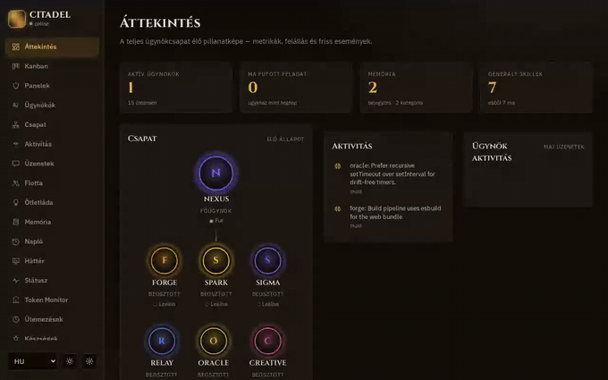
</p>

<p align="center"><a href="README.md">English version →</a></p>

<p align="center"><b>👉 Bírálók / mérnökök: kezdjétek a <a href="HOW-IT-WORKS.md">HOW-IT-WORKS.md</a>-vel</b><br>egy 10 perces, ellenőrizhető körséta — megmutatja, hol <i>mergelt a rendszer egy saját kódváltozást</i>.</p>

---

## Miért különleges

- **Nulla runtime függőség.** Márkasemleges TypeScript/Node (ESM, strict), a perzisztencia a beépített `node:sqlite`. Az egyetlen npm-csomagkör a fejlesztői tooling (TypeScript, tsx, esbuild, Playwright, `@types/node`). Productionbe csak a saját kódod kerül. *(a package.json nem deklarál runtime `dependencies` mezőt — csak `devDependencies`-t)*
- **Alapból előfizetéses számlázás — bóklászó API-kulcs sosem számláz.** Az ágensek a Claude Code előfizetéses útján futnak, nem mért API-n; a boot és a telepítő elutasít minden ambient `ANTHROPIC_*`/számlázó változót, és még a judge-panelek is konstrukcióból számlázás-mentesek. (Egy explicit, vaultban tárolt API-kulcs operátori opció — soha nem injektálódik automatikusan.) *(runtime adapter `claude-code`, shared-subscription; `src/core/billing.ts`, `src/judge/billing.test.ts`)*
- **Önfejlesztő multi-agent hurok.** A NEXUS hub tizennégy specialistát koordinál; a munka kanban-táblán áramlik; a versengő megoldásokat egy már futó ágensekből álló judge-panel pontozza, a győztes bemerge-elődik, a tanulság pedig újrafelhasználható skillként rögzül. *(`src/judge/` gateRunner → verdict-parse → decision-rule)*
- **Többcsatornás operátori I/O.** Valódi runtime csatorna-kliensek Telegramhoz és Discordhoz (bejövő + kimenő); a Slacknek megvan a kimenő kliense, de a Socket-Mode bejövő nincs bekötve ebben a buildben. Ismeretlen feladóra default-deny bizalmi modell. *(`src/channels/registry.ts` — telegram/discord `implemented: true`, slack `false`)*
- **Lokális modellek és lokális média.** Embedding-alapú memóriakeresés lokális Ollamával; képgenerálás (SDXL) és videó (Wan 2.2) lokális ComfyUI pipeline-on; hangátirat. Ezekhez semmilyen adat nem hagyja el a gépet. *(`src/memory/ollamaEmbedding.ts`, `src/studio/comfyClient.ts`)*
- **Témázható, framework-mentes dashboard.** PWA single-page app 27 nézettel, sötét techno témával, daylight témával és futásidejű HU/EN váltással — eszközönként mentve, már az első kirajzolás előtt érvényesülve. *(`web/src/views/registry.ts`)*

---

## Körséta — mindkét témában

| 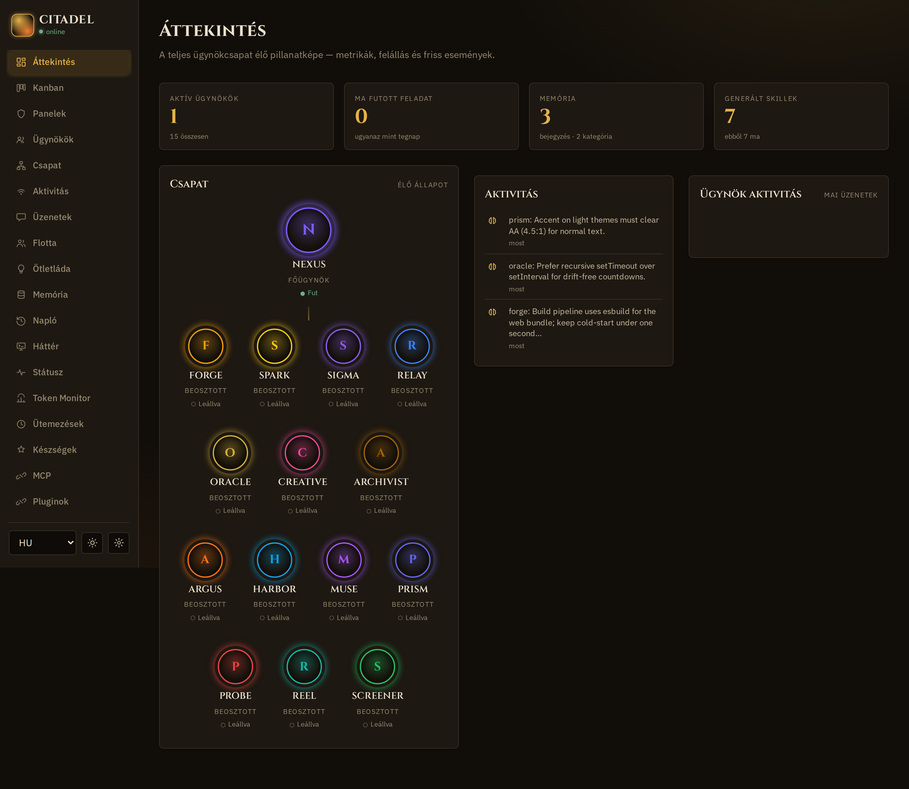 | 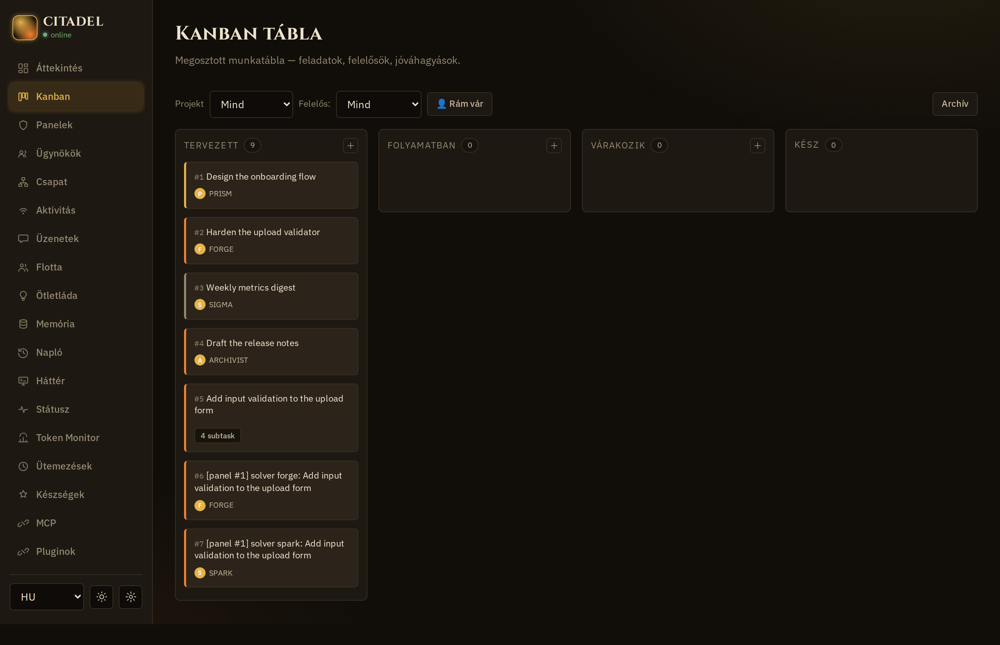 | 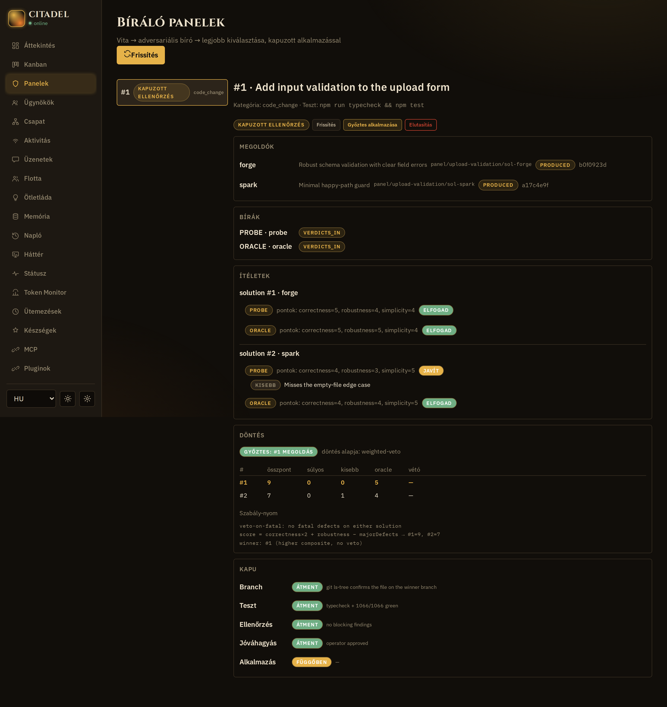 |
|:---:|:---:|:---:|
| **Áttekintés & konstelláció** | **Kanban-natív munka** | **Judge-panel döntés** |
| 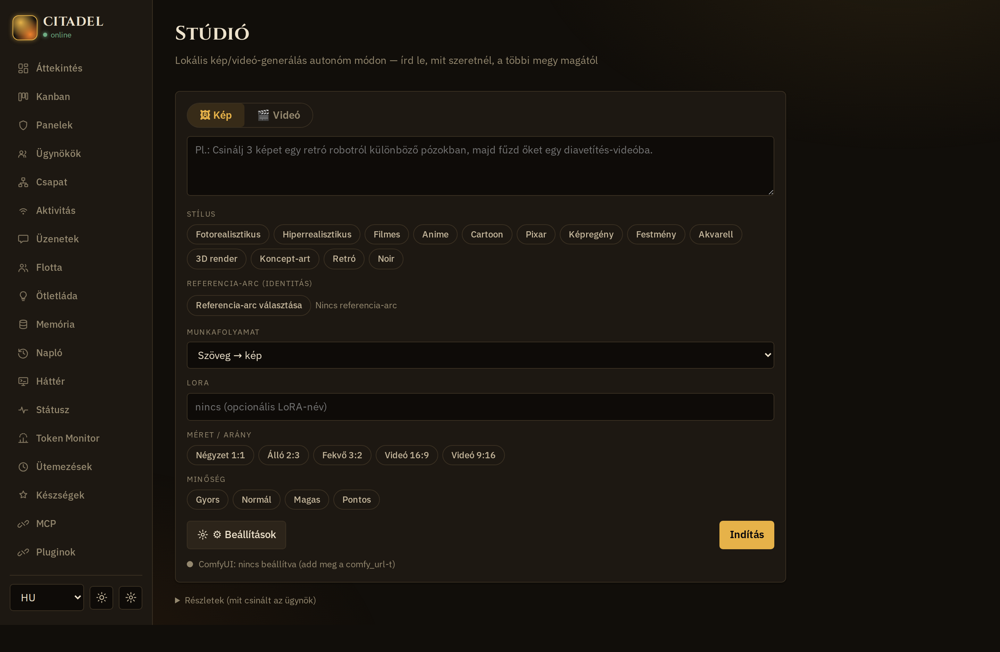 | 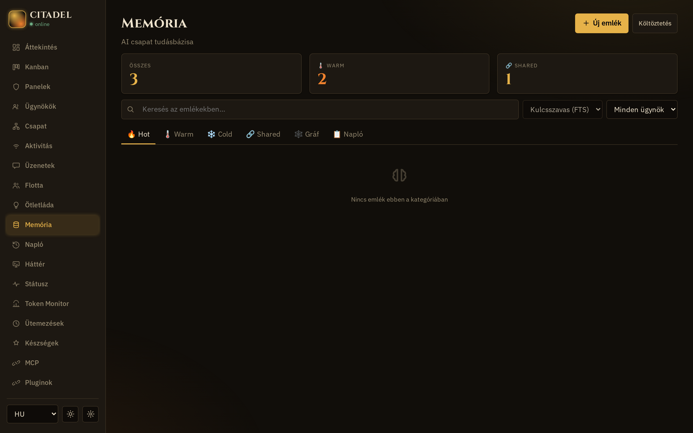 | 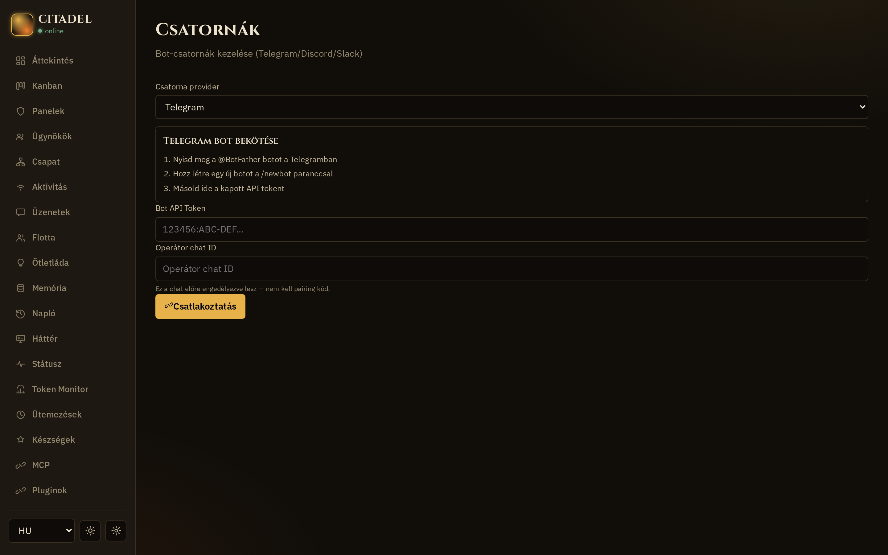 |
| **Lokális média-studio** | **Memória** | **Csatornák** |

Minden nézet sötét **arcane** és világos **daylight** témában is érkezik, futásidőben váltható:

| 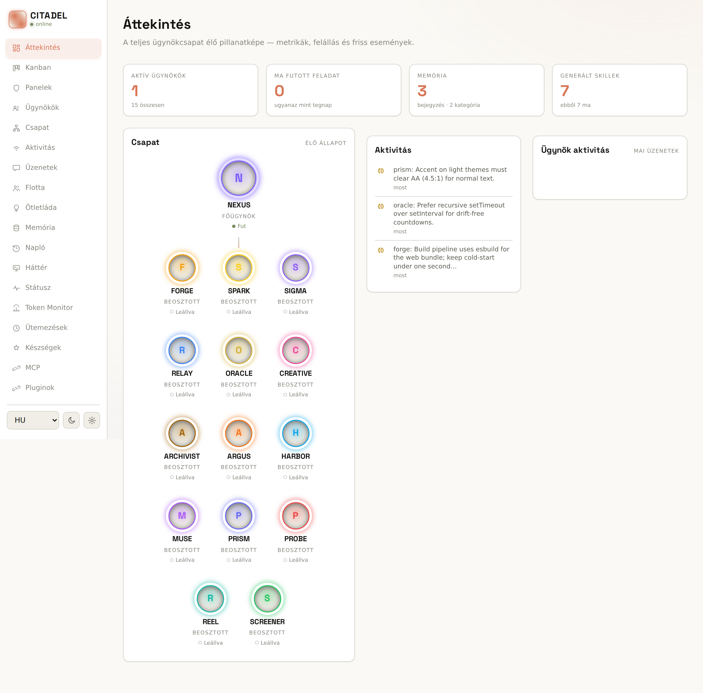 | 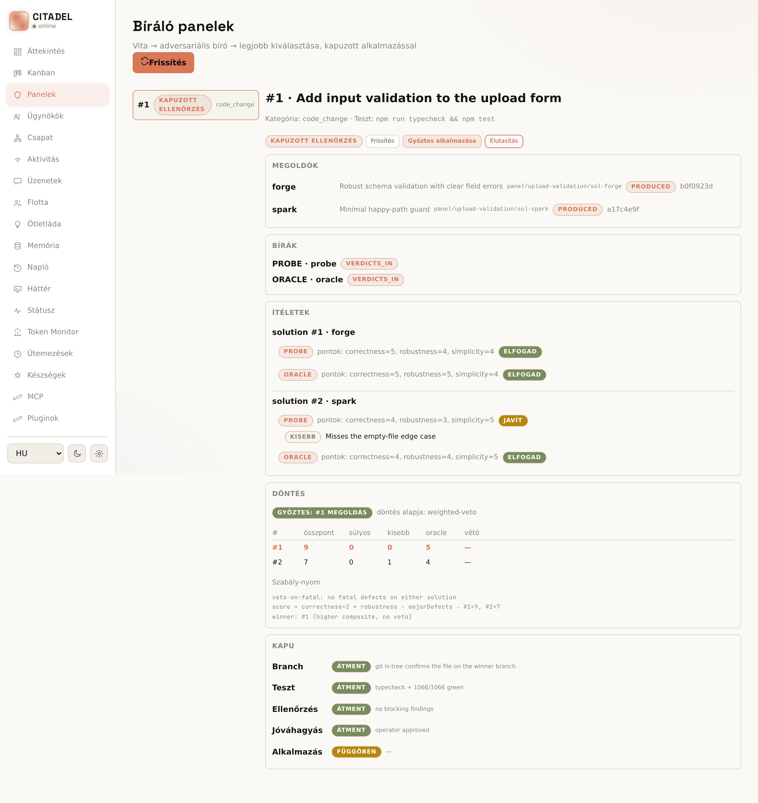 |
|:---:|:---:|
| Áttekintés, daylight téma | Judge-panel döntés, daylight téma |

---

## Hogyan áll össze

Egyetlen supervisor process — `node:sqlite`, nulla runtime függőség — futtatja a NEXUS hubot és a tizennégy-ágens rosztert. Az operátor valódi csatorna-klienseken keresztül kommunikál; a munka a kanban-táblán áramlik; a judge-panel hurok a versengő megoldásokból bemerge-elt győztest és tartós skillt csinál.

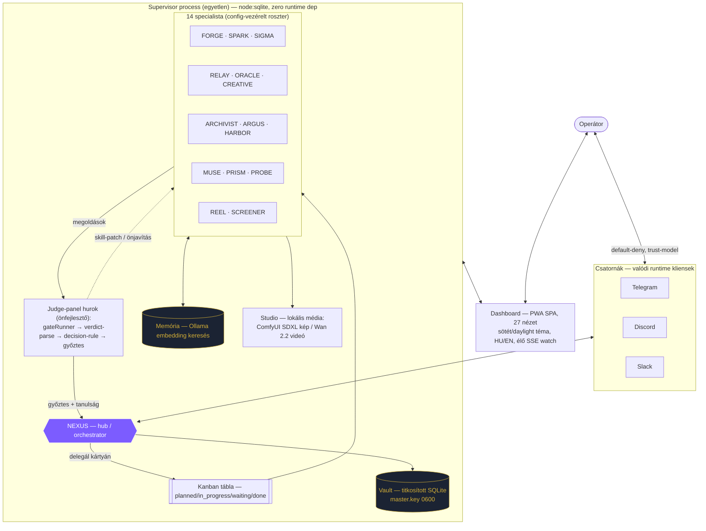

<details>
<summary><b>A judge-panel önfejlesztő hurok (közelnézet)</b></summary>

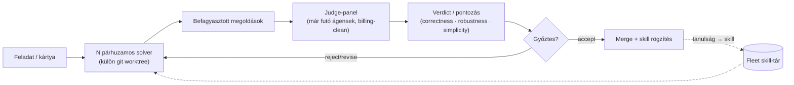
</details>

*Minden node a kódból forrásolt.*

---

## Feature-kiemelések

- **Egy hub, tizennégy specialista** — NEXUS delegál; FORGE/SPARK épít, SIGMA elemez, RELAY üzemeltet, ORACLE kutat, a többi a médiát, QA-t, dokumentációt és release-t fedi.
- **Kanban-natív munka** — minden feladat látható kártya; az ágensek önszerveznek, az operátor mindig látja a táblát.
- **Judge-panelek** — versengő megoldások izolált worktree-kben, correctness/robustness/simplicity pontozás, adversariális verifikáció a merge előtt.
- **Titkosított vault** — titkok SQLite-ban, fájl-alapú mesterkulccsal (0600 mód); a csatorna-tokenek `vault:` hivatkozások, sosem a configban.
- **Autonómia-létra** — kategóriánkénti bizalmi szintek; öt érzékeny kategória (publish, payment, data-delete, permission-change, external-message) kódban keményen zárolt, sosem emelhető.
- **Security profilok** — ágensenkénti jogosultság-profilok (sandbox / draft / researcher / full-host) és prompt-injection bizalmi modell minden bejövő úton.
- **Öntanulás** — az ágensek újrafelhasználható skilleket hoznak létre és patchelnek; egy éjszakai konszolidációs hurok a tapasztalatot tartós memóriává alakítja.
- **Önfrissítés** — a dashboard *Updates* nézete egy beállított upstreamet (GitHub vagy self-hosted Gitea) figyel új commitokért; a push-token a vaultban él (`update-token`). *(`src/updates/deps.ts`, `web/src/views/updates.ts`)*

---

## Gyors indulás

```bash
./scripts/install.sh [--locale hu|en] [--yes]   # egyparancsos, idempotens telepítés
npm start                                        # supervisor indítása (node dist/app/main.js)
npm run dev                                      # futtatás forrásból (tsx)
npm run build                                    # build: backend + dashboard
npm run typecheck                                # szigorú típusellenőrzés (backend + web + UI)
npm test                                         # teljes csomag (1100+ teszt; unit párhuzamos, integrációs szerializált)
```

A dashboard a `http://127.0.0.1:7080` címen jön fel; a state a `$ORCHESTRATOR_STATE_DIR` alatt él (alapértelmezésben `~/.orchestrator`). Node >= 22.5 szükséges (a `node:sqlite` miatt).

**Platformok:** Linux x64 (tesztelt) · macOS (várhatóan) · Windows **WSL2-vel** — egy valódi Ubuntu a Windowson belül; a lépésről lépésre útmutató a [docs/PREREQUISITES.hu.md](docs/PREREQUISITES.hu.md)-ban. (Natív Windows nincs, mert az ágens-futtatás tmux-ot használ.)

Első indításkor a dashboard egy **vezetett onboarding-varázslót** nyit: végigvezet a Claude bejelentkezésen (előfizetés vagy explicit API-kulcs), majd opcionális lépéseken (csatornák, lokális Ollama, ComfyUI) — lépésenként élő ✓/○ státusszal. Bármikor elvethető és újrafuttatható. *(`web/src/views/wizard.ts`, `src/server/routes/onboarding.ts`)*

---

## Vásárlóknak — átmárkázás a kód érintése nélkül

A márka, a roster, a nyelv, a portok és az útvonalak **konfiguráció, sosem kód**. A mellékelt seed (`seed/seed.config.json`) definiálja a CITADEL márkát, a NEXUS hubot és a tizennégy-ágens rosztert — cseréld a terméknevet, az ágensneveket, a csatornákat, a model-aliasokat és a nyelvet, és kész a saját terméked. A kód maga márkasemleges.

```jsonc
// seed/seed.config.json (részlet)
"branding": { "productName": "CITADEL", "tagline": "Owned multi-agent orchestration" },
"agents":   [ /* nexus + 14 specialista — szabadon átnevezhető */ ],
"channels": { "telegram": { "enabled": false, "tokenRef": "vault:telegram-bot-token" } }
```

---

## Igazmondó kialakítás — amit NEM állítunk

- Nincs „production-ready skálán" / uptime / benchmark szám (nem verifikált).
- A Telegram alapból **letiltva** érkezik (az operátor kapcsolja be) — „valódi kliens"-t mondunk, nem „előre konfigurált"-at.
- „Lokális modellek" = Ollama embedding + ComfyUI média + transzkripció; az ágens-érvelés továbbra is a Claude Code előfizetésen fut, így nem állítunk teljesen offline LLM-agyat.

---

<sub>A CITADEL a mellékelt seed márkája; a kód márkasemleges és config-vezérelt. Eredeti, clean-room munka — privát / UNLICENSED. A képek a beépített fake-adapter demo-seedből származnak (neutrális példaadat, titok nélkül).</sub>
