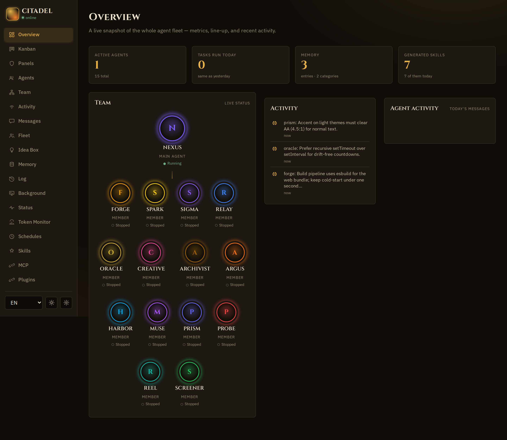
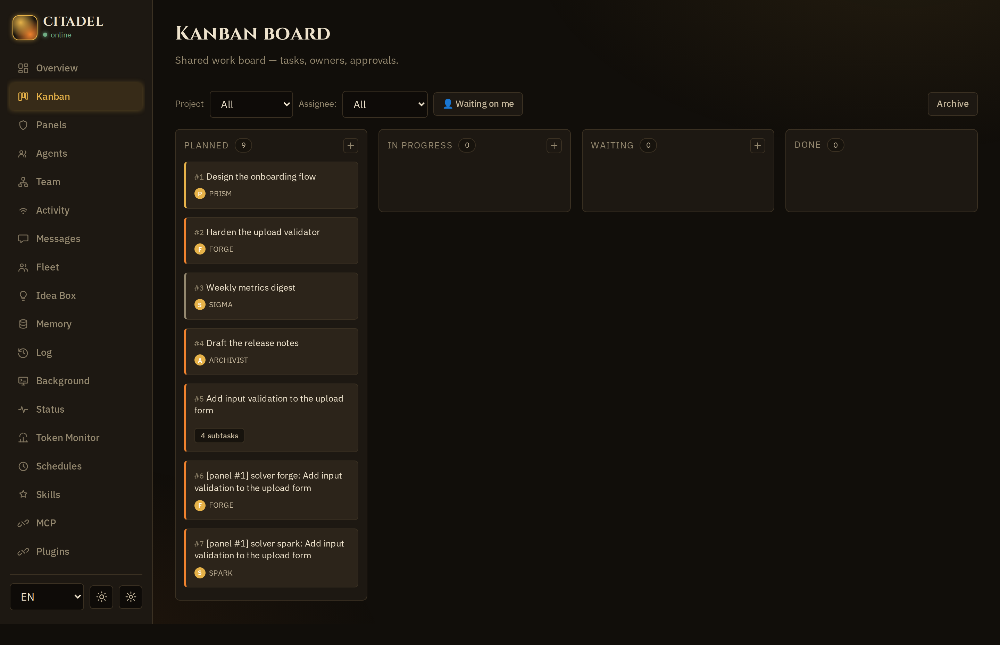
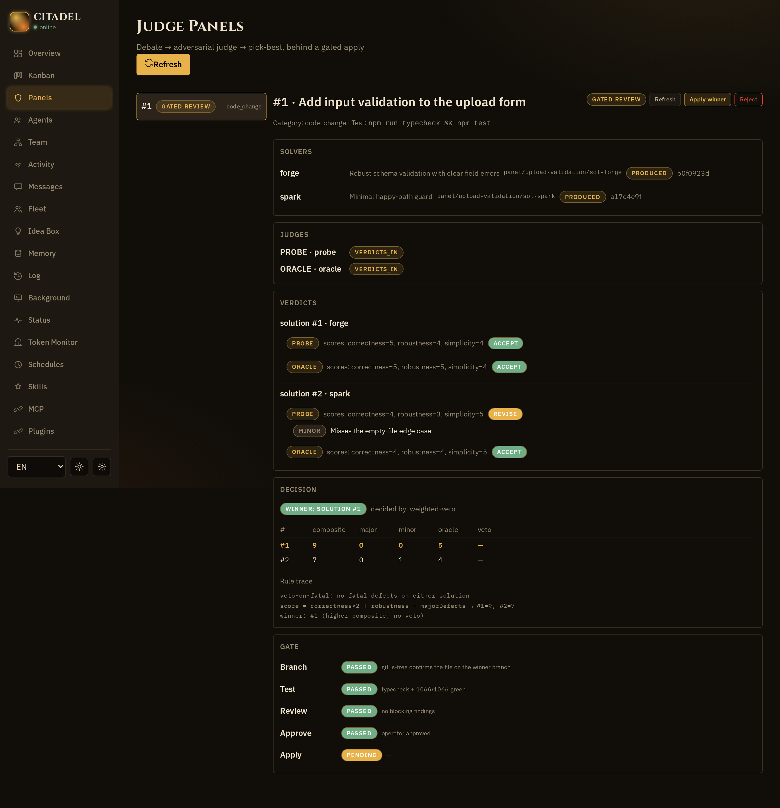
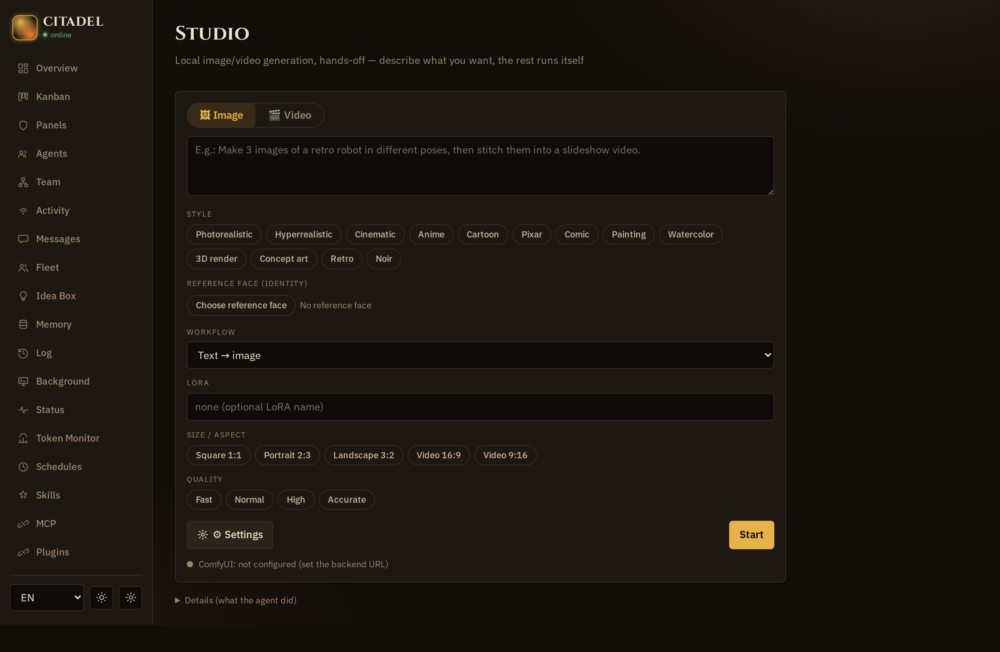
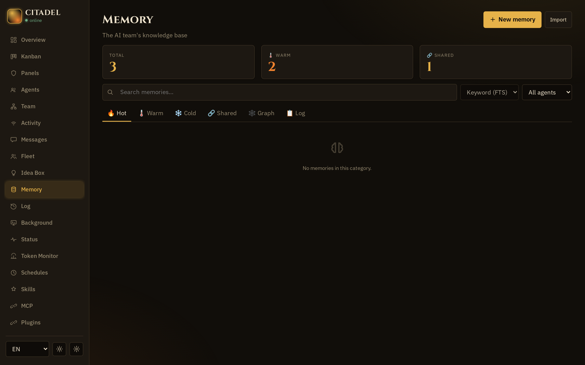
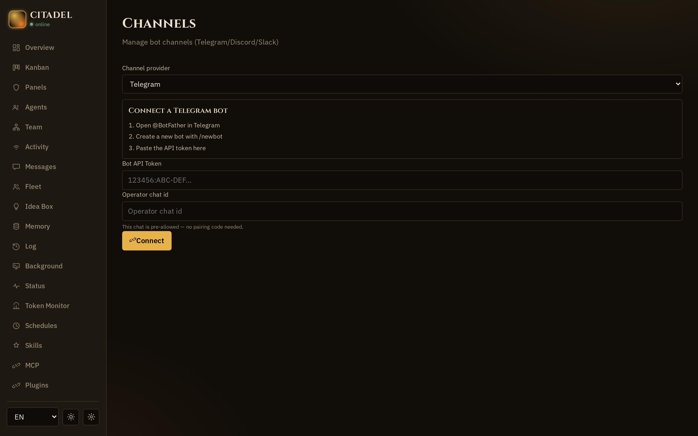
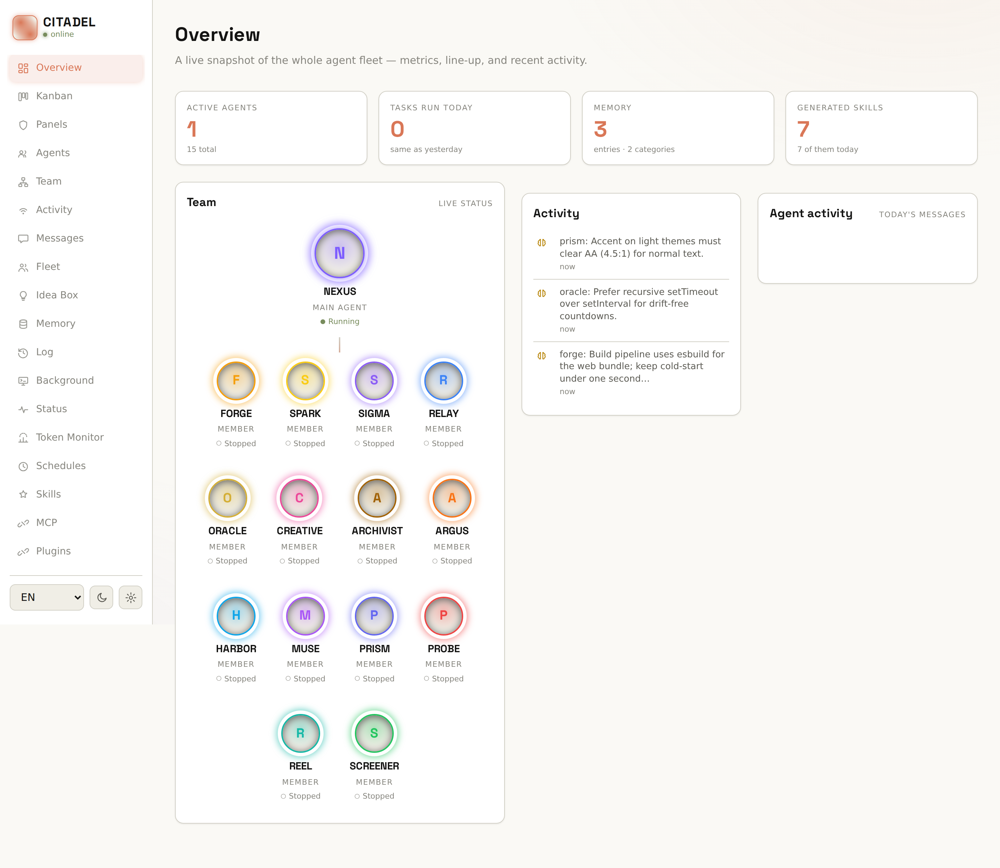
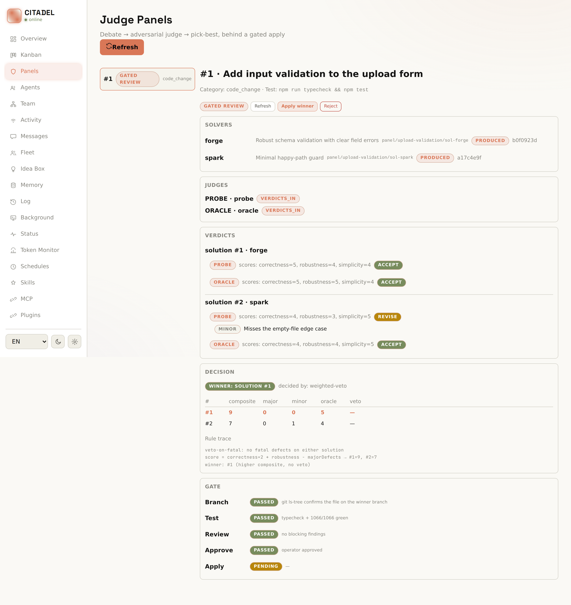
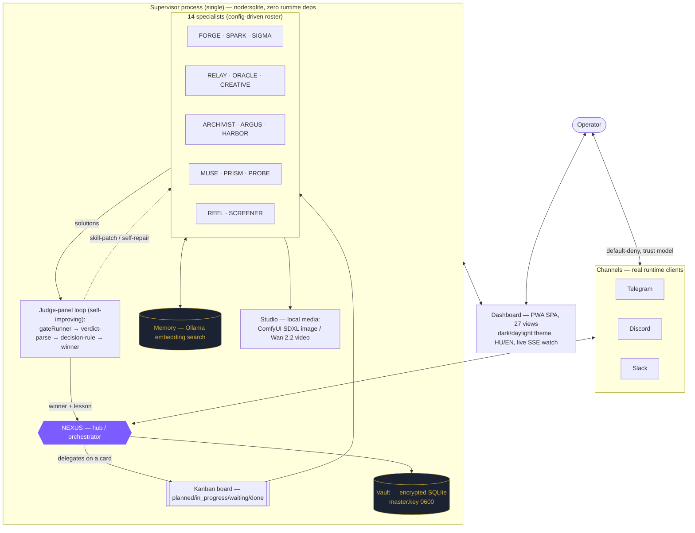
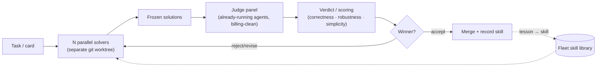

<p align="center">
  
</p>

<h1 align="center">CITADEL</h1>

<p align="center">
  <b>An owned, self-improving multi-agent fleet that runs on your subscription — not your API budget.</b><br>
  Zero runtime dependencies · clean-room · yours to rebrand and sell.
</p>

<p align="center">
  
</p>

<p align="center"><a href="README.hu.md">Magyar verzió →</a></p>

<p align="center"><b>👉 Reviewers / engineers: start with <a href="HOW-IT-WORKS.md">HOW-IT-WORKS.md</a></b><br>a 10-minute, verifiable tour — it shows where the system <i>merged its own code change</i>.</p>

---

## Why it's different

- **Zero runtime dependencies.** Brand-neutral TypeScript/Node (ESM, strict), persistence on the built-in `node:sqlite`. The only npm packages are dev tooling (TypeScript, tsx, esbuild, Playwright, `@types/node`). Nothing ships into production but your own code. *(package.json declares no runtime `dependencies` field — only `devDependencies`)*
- **Subscription billing by default — no stray API key can ever bill.** Agents run through the Claude Code subscription path, not a metered API; boot + the installer refuse any ambient `ANTHROPIC_*`/billing var, and even the judge panels are billing-clean by construction. (An explicit, vault-stored API key is an operator opt-in — never auto-injected.) *(runtime adapter `claude-code`, shared-subscription; `src/core/billing.ts`, `src/judge/billing.test.ts`)*
- **A self-improving multi-agent loop.** A NEXUS hub orchestrates fourteen specialists; work flows across a kanban board; competing solutions are scored by a judge panel of already-running agents, the winner merges, and the lesson is captured as a reusable skill. *(`src/judge/` gateRunner → verdict-parse → decision-rule)*
- **Multi-channel operator I/O.** Real runtime channel clients for Telegram and Discord (inbound + outbound); Slack has the outbound client but its Socket-Mode inbound is not wired in this build. Default-deny trust model for unknown senders. *(`src/channels/registry.ts` — telegram/discord `implemented: true`, slack `false`)*
- **Local models & local media.** Embedding-based memory search via local Ollama; image generation (SDXL) and video (Wan 2.2) via a local ComfyUI pipeline; voice transcription. No data leaves the box for these. *(`src/memory/ollamaEmbedding.ts`, `src/studio/comfyClient.ts`)*
- **A themeable, no-framework dashboard.** A PWA single-page app spanning 27 views, with a dark techno theme, a daylight theme and runtime HU/EN switching — persisted per device, applied before first paint. *(`web/src/views/registry.ts`)*

---

## A tour — in both themes

|  |  |  |
|:---:|:---:|:---:|
| **Overview & constellation** | **Kanban-native work** | **Judge-panel decision** |
|  |  |  |
| **Local media studio** | **Memory** | **Channels** |

Every view ships in a dark **arcane** theme and a light **daylight** theme, switchable at runtime:

|  |  |
|:---:|:---:|
| Overview, daylight theme | Judge-panel decision, daylight theme |

---

## How it fits together

A single supervisor process — `node:sqlite`, zero runtime deps — hosts the NEXUS hub and the fifteen-agent roster. The operator talks to it over real channel clients; work flows across the kanban board; the judge-panel loop turns competing solutions into a merged winner plus a durable skill.



<details>
<summary><b>The judge-panel self-improvement loop (close-up)</b></summary>


</details>

*Every node above is sourced from the code.*

---

## Feature highlights

- **One hub, fourteen specialists** — NEXUS delegates; FORGE/SPARK build, SIGMA analyzes, RELAY runs infra, ORACLE researches, the rest cover media, QA, docs and release.
- **Kanban-native work** — every task is a visible card; agents self-organize, the operator always sees the board.
- **Judge panels** — competing solutions in isolated worktrees, scored on correctness/robustness/simplicity, adversarially verified before merge.
- **Encrypted vault** — secrets in SQLite under a file-backed master key (mode 0600); channel tokens are `vault:` refs, never in config.
- **Autonomy ladder** — per-category trust levels; five sensitive categories (publish, payment, data-delete, permission-change, external-message) are hard-locked in code and can never be raised.
- **Security profiles** — per-agent permission profiles (sandbox / draft / researcher / full-host) and a prompt-injection trust model on every inbound path.
- **Self-learning** — agents generate and patch reusable skills; a nightly consolidation loop turns experience into durable memory.
- **Self-update** — a dashboard *Updates* view checks a configured upstream (GitHub or a self-hosted Gitea) for new commits; the push token lives in the vault (`update-token`). *(`src/updates/deps.ts`, `web/src/views/updates.ts`)*

---

## Quick start

```bash
./scripts/install.sh [--locale hu|en] [--yes]   # one-command, idempotent install
npm start                                        # run the supervisor (node dist/app/main.js)
npm run dev                                      # run from source (tsx)
npm run build                                    # build backend + dashboard
npm run typecheck                                # strict typecheck (backend + web + UI)
npm test                                         # the full suite (1100+ tests; unit concurrent, integration serialized)
```

The dashboard comes up on `http://127.0.0.1:7080`; state lives under `$ORCHESTRATOR_STATE_DIR` (default `~/.orchestrator`). Requires Node >= 22.5 (for `node:sqlite`).

**Platforms:** Linux x64 (tested) · macOS (expected) · Windows **via WSL2** — a real Ubuntu inside Windows; see [docs/PREREQUISITES.en.md](docs/PREREQUISITES.en.md) for the step-by-step. (Native Windows isn't supported because the agent runtime uses tmux.)

On first launch the dashboard opens a **guided onboarding wizard**: it walks you through Claude sign-in (subscription or an explicit API key), then optional steps for channels, local Ollama and ComfyUI — each with a live ✓/○ status. You can dismiss it and re-run it any time. *(`web/src/views/wizard.ts`, `src/server/routes/onboarding.ts`)*

---

## For buyers — rebrand without touching code

Branding, roster, locale, ports and paths are **configuration, never code**. The shipped seed (`seed/seed.config.json`) defines the CITADEL brand, the NEXUS hub and the fifteen-agent roster (fourteen specialists) — swap the product name, the agent names, the channels, the model aliases and the language, and you have your own product. The code itself is brand-neutral.

```jsonc
// seed/seed.config.json (excerpt)
"branding": { "productName": "CITADEL", "tagline": "Owned multi-agent orchestration" },
"agents":   [ /* nexus + 14 specialists — rename freely */ ],
"channels": { "telegram": { "enabled": false, "tokenRef": "vault:telegram-bot-token" } }
```

---

## Truthful by design — claims we don't make

- No "production-ready at scale" / uptime / benchmark numbers (unverified).
- Telegram ships **disabled by default** (the operator enables it) — we say "real client", not "preconfigured".
- "Local models" = Ollama embeddings + ComfyUI media + transcription; the agent reasoning still runs through the Claude Code subscription, so we do not claim a fully-offline LLM brain.
- **Privacy — layered, not all-or-nothing.** This is not a claim that "everything is anonymized." It is layered masking + local execution + documented residuals:
  - *Regulated / structured PII is masked on the customer-support path* before any cloud LLM reads it: email addresses, phone numbers, Hungarian tax IDs (adószám), EU VAT numbers, IBANs, Hungarian bank-account numbers, and card numbers are replaced with semantic placeholder tokens. Complaint semantics, amounts and order numbers are preserved.
  - *Local-only paths:* the memory and embedding layer uses a local Ollama instance and sends no data to a cloud provider. (Structured records an agent reads to answer a request still reach the cloud LLM; masking those at a local gateway is on the roadmap — see [ROADMAP.md](ROADMAP.md).)
  - *Known limitations (roadmap):* free-text personal-name redaction (NER) is not yet active — a name written inline in a message body may still reach the cloud LLM. A deeper local-gateway egress split for structured agent reads is also planned. Both are on the public roadmap; see [ROADMAP.md](ROADMAP.md).

---

<sub>CITADEL is the shipped seed brand; the code is brand-neutral and config-driven. Original, clean-room work — private / UNLICENSED. Screenshots are from the bundled fake-adapter demo seed (neutral example data, no secrets).</sub>
